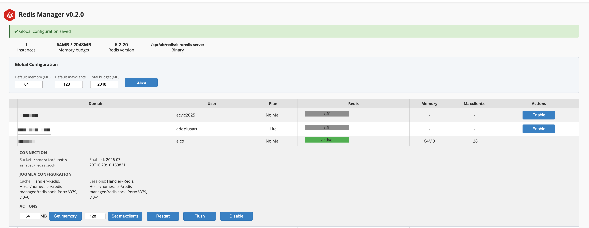

# RedisManager for cPanel/WHM

<p align="center">
  
</p>

**RedisManager** is a lightweight WHM plugin that provides per-user isolated Redis instances on CloudLinux Shared PRO servers with cPanel. It reuses the Redis binary shipped by CloudLinux's AccelerateWP (`alt-redis`) and applies the same socket-based isolation model — but for **any CMS**, not just WordPress.

Built primarily for **Joomla** sites that can't use AccelerateWP, but works for any application that supports Redis via Unix sockets.

<p align="center">
  
</p>

## What it does

- Creates **isolated Redis instances per cPanel user**, each running under the user's UID inside CageFS
- Uses **Unix sockets** (no TCP ports exposed) with `600` permissions — users can only access their own Redis
- Integrates with **CloudLinux LVE limits** — Redis memory and CPU count towards the user's resource allocation
- Provides a **WHM admin interface** (Plugins → Redis Manager) to enable/disable Redis per account, adjust memory and maxclients, and edit global settings
- Automatically deploys **PHP session locking** (`.user.ini`) to prevent race conditions in Joomla admin
- Includes **cPanel hooks** for automatic cleanup on account deletion/suspension
- Runs a **health check cron** every 5 minutes to restart failed instances
- Enforces a **global memory budget** (default: 2 GB) to prevent overcommitting server RAM
- Uses **file locking** (`flock`) on the state file to prevent corruption from concurrent access (WHM, CLI, cron, hooks)

## What it does NOT do

- **Does not install its own Redis binary.** It depends on `alt-redis`, the Redis package shipped by CloudLinux as part of AccelerateWP. If `alt-redis` is not installed, RedisManager will refuse to enable instances.
- **Does not interfere with AccelerateWP.** WordPress sites managed by AccelerateWP continue to work as before. RedisManager uses a separate directory (`~/.redis-managed/`) and AccelerateWP's monitoring daemon ignores our instances (verified by code inspection of `clwpos_monitoring`'s `_validate_redis_proc()` — it specifically checks for `.clwpos/redis.sock` in the process cmdline).
- **Does not configure your CMS automatically.** After enabling Redis for a user, you must manually configure the CMS (Joomla, Drupal, etc.) to use the Redis socket. Instructions are shown in the WHM interface.
- **Does not provide Redis Cluster, Sentinel, or replication.** Each instance is a standalone, single-node Redis server running in cache-only mode (no persistence).
- **Does not manage AccelerateWP instances.** WordPress Redis managed by AccelerateWP is completely separate and should be managed through CloudLinux's own tools.

## Requirements

- **CloudLinux Shared PRO** v8.x or v9.x with CageFS enabled
- **cPanel/WHM** 110+ (tested on 134.0.x)
- **alt-redis** package installed (comes with AccelerateWP / CloudLinux Shared PRO)
- Root access to the server

## Compatibility

- **Redis → Valkey migration:** CloudLinux may migrate from Redis to Valkey (the open-source Redis fork). This is fully compatible — same protocol, same config format. Update `REDIS_BINARY` in the global configuration and reinstall the systemd template unit (re-run `install.sh`). See [Known limitation: REDIS_BINARY vs systemd](#known-limitation-redis_binary-vs-systemd).

## Installation

### Quick install (one-liner)

```bash
curl -sSL https://raw.githubusercontent.com/velisnolis/RedisManager/main/install-remote.sh | bash
```

> **Note:** This is the standard `curl | bash` pattern used by many tools (Homebrew, rustup, nvm...). The download is over HTTPS from GitHub. If you prefer to verify the code before executing, use the manual install method below.

### Manual install

1. Clone the repository:

```bash
git clone https://github.com/velisnolis/RedisManager.git /tmp/redismanager
```

2. Run the installer as root:

```bash
cd /tmp/redismanager
bash install.sh
```

The installer will:
- Copy files to `/opt/redismanager/`
- Install the systemd template unit (`redis-managed@.service`)
- Register the WHM plugin and icon
- Register cPanel hooks for account lifecycle events
- Set up the health check cron job
- Create a convenience symlink at `/usr/local/sbin/redismanager-ctl`

3. Verify:

```bash
redismanager-ctl info
```

### Updating

To update an existing installation, pull the latest code and re-run the installer:

```bash
cd /tmp/redismanager && git pull
bash install.sh
```

Or use the one-liner — it clones fresh and runs `install.sh`, overwriting the previous installation. Existing state (`state.json`) and running instances are preserved.

## Uninstallation

```bash
cd /tmp/redismanager   # or wherever the source is
bash uninstall.sh
```

This will stop all managed Redis instances, remove user data directories, unregister the WHM plugin and hooks, and clean up all installed files. Logs are preserved at `/var/log/redismanager/`.

## Usage

### WHM Interface

Go to **WHM → Plugins → Redis Manager**. From there you can:

- **Enable** Redis for any cPanel account (uses default memory and maxclients from global config)
- **Expand** a managed account row (click `+`) to see connection details, Joomla config, and actions
- **Set memory / maxclients** per account
- **Restart**, **Flush**, or **Disable** an instance
- **Edit global configuration** (default memory, default maxclients, total budget) — saved to `/opt/redismanager/etc/redismanager.conf`

### Command Line

```bash
# Enable Redis for a user (default 64MB, 128 maxclients)
redismanager-ctl enable <username> [memory_mb]

# Disable Redis (stops instance, removes data, cleans .user.ini)
redismanager-ctl disable <username>

# Check status
redismanager-ctl status <username>

# List all managed instances
redismanager-ctl list

# Restart an instance
redismanager-ctl restart <username>

# Flush all data
redismanager-ctl flush <username>

# Change memory limit (restarts the instance)
redismanager-ctl set-memory <username> <mb>

# Change max client connections (default 128, range 8-1024)
redismanager-ctl set-maxclients <username> <n>

# Show global info (binary version, memory budget, etc.)
redismanager-ctl info
```

## CMS Configuration

### Joomla 4/5

After enabling Redis for a user, configure Joomla at **System → Global Configuration → System**:

| Setting | Value |
|---|---|
| Cache Handler | `Redis` |
| Redis Server Host | `/home/<username>/.redis-managed/redis.sock` |
| Redis Server Port | `6379` *(default — ignored when using a socket, but Joomla requires a valid port number)* |
| Redis Server Database | `0` |
| Redis Persistent | `Yes` *(recommended — reuses PHP connections, reduces overhead)* |
| Redis Server Auth | *(leave empty)* |

For sessions (**System → Global Configuration → System → Session**):

| Setting | Value |
|---|---|
| Session Handler | `Redis` |
| Redis Server Host | `/home/<username>/.redis-managed/redis.sock` |
| Redis Server Port | `6379` |
| Redis Server Database | `1` *(separate DB from cache)* |
| Redis Persistent | `Yes` |

> **Why port 6379?** Joomla validates the port field and rejects `0`. When the host is a Unix socket path, the port value is ignored at connection time, but Joomla still requires a valid port number in the form. `6379` (the Redis default) is the safe choice.

> **Why separate databases?** Using DB 0 for cache and DB 1 for sessions lets you flush the cache (`FLUSHDB` on DB 0) without destroying active user sessions.

### PHP Session Locking (automatic)

When Redis is used as a session handler, PHP's `phpredis` extension does **not** enable session locking by default (`redis.session.locking_enabled = 0`). Without it, concurrent requests — common in Joomla admin where multiple AJAX calls fire simultaneously — read and write the same session data in parallel. This causes race conditions with symptoms including:

- Random 500 Internal Server Errors
- Extension download keys appearing as "not configured" intermittently
- Form data or settings resetting themselves
- General "poltergeist" behavior that disappears when switching back to file-based sessions

**RedisManager automatically deploys** a `.user.ini` file to all document roots (main domain + addon/subdomains) when enabling Redis for a user:

```ini
; >>> RedisManager session locking — do not edit
redis.session.locking_enabled = 1
redis.session.lock_retries = 300
redis.session.lock_wait_time = 10000
; <<< RedisManager
```

| Setting | Value | Why |
|---|---|---|
| `redis.session.locking_enabled` | `1` | Serializes session access — only one request can write at a time |
| `redis.session.lock_retries` | `300` | Retry up to 300 times before giving up (300 × 10ms = 3 seconds max wait) |
| `redis.session.lock_wait_time` | `10000` | Wait 10ms between retries — balances responsiveness vs CPU usage |

**Why `.user.ini`?** On cPanel with PHP-FPM or LSAPI, `.user.ini` is the standard, non-destructive way to override PHP settings per directory without touching global `php.ini` or cPanel-managed vhost configs. PHP re-reads it every `user_ini.cache_ttl` seconds (default 300). The file uses marker comments (`>>> RedisManager` / `<<< RedisManager`) so we can cleanly add and remove our block without affecting other settings in the same file.

**Cleanup:** When Redis is disabled for a user, only the RedisManager block is removed from `.user.ini`. If the file had other settings, they're preserved. If it becomes empty, the file is deleted.

**New domains:** If you add a new addon domain or subdomain after enabling Redis, the `.user.ini` won't be deployed to the new document root automatically. Run `redismanager-ctl disable <user>` followed by `redismanager-ctl enable <user>` to redeploy.

### Maxclients tuning

The default `maxclients` is **128**, which is suitable for most shared hosting accounts. If you see `ERR max number of clients reached` in the Redis log or `session_write_close() failed` errors:

1. Check current connections: `redis-cli -s /home/<user>/.redis-managed/redis.sock INFO clients`
2. Increase if needed: `redismanager-ctl set-maxclients <user> 256`

**Why this matters:** With Joomla's `redis_persist = true` (persistent connections), each PHP/LSAPI worker maintains an open connection to Redis. Under normal traffic with frontend visitors, admin users, bots, and subdomains all hitting the same account, you can easily have 20-50 simultaneous workers. The old default of 16 was too low and caused systematic 500 errors.

### Other CMS / Frameworks

Any application that supports Redis via Unix sockets can use the managed instance. The connection details are always:

- **Socket:** `/home/<username>/.redis-managed/redis.sock`
- **Port:** not applicable (socket connection)
- **Password:** none
- **Databases:** 0 and 1 available (2 databases configured by default)

## Architecture

```
/opt/redismanager/
├── bin/redismanager-ctl              # Control script (CLI)
├── etc/redismanager.conf             # Global config (binary path, budget, defaults)
├── templates/
│   ├── redis-managed.service         # Systemd template unit
│   └── redis-user.conf.tmpl          # Per-user Redis config template
├── hooks/redismanager-hooks          # cPanel lifecycle hooks
└── cron/redismanager-healthcheck     # Health check (runs every 5 min)

/usr/local/cpanel/whostmgr/docroot/
├── cgi/addon_redismanager.cgi        # WHM admin interface (Perl CGI)
└── addon_plugins/redismanager-icon.svg  # Plugin icon

/etc/systemd/system/
└── redis-managed@.service            # Systemd template (one instance per user)

/var/lib/redismanager/state.json      # Enabled users and their config (flock-protected)
/var/run/redismanager-state.lock      # Lock file for concurrent state access
/var/log/redismanager/                # Plugin, hook, and health check logs

Per user (created on enable, removed on disable):
/home/<user>/.redis-managed/
├── redis.conf                        # Auto-generated Redis config
├── redis.sock                        # Unix socket (permissions 600)
├── redis.pid                         # PID file
└── redis.log                         # Instance log

/home/<user>/public_html/.user.ini    # PHP session locking (auto-deployed)
```

### How isolation works

Each Redis instance is launched via `cagefs_enter.proxied` under the user's UID, the same mechanism AccelerateWP uses. This means:

- The Redis process runs **inside CageFS** with the user's filesystem view
- **LVE limits apply** — memory and CPU count towards the user's CloudLinux resource allocation
- The socket has **600 permissions** — only the owning user can connect
- **AccelerateWP's monitoring daemon** (`clwpos_monitoring`) ignores our instances because it specifically looks for processes with `.clwpos/redis.sock` in their command line (verified in `clwpos/daemon_redis_lib.py` → `_validate_redis_proc()`)

### Concurrency and state integrity

The state file (`state.json`) is accessed by four independent processes: the CLI, the WHM CGI, the cron health check, and cPanel hooks. All access is protected by `flock`:

- **Read operations** use a shared lock (`flock -s`) — multiple readers can proceed simultaneously
- **Write operations** use an exclusive lock (`flock`) — only one writer at a time
- **Writes are atomic** — data is written to a temporary file first, then renamed (`os.rename`), preventing partial/corrupted reads

### Coexistence with AccelerateWP

| | AccelerateWP (WordPress) | RedisManager |
|---|---|---|
| Directory | `~/.clwpos/` | `~/.redis-managed/` |
| Socket | `~/.clwpos/redis.sock` | `~/.redis-managed/redis.sock` |
| Manager | `clwpos_monitoring` daemon | systemd + cron health check |
| Binary | `/opt/alt/redis/bin/redis-server` | Same binary |

A user can have **both** an AccelerateWP Redis instance (for WordPress) and a RedisManager instance (for Joomla or other CMS) running simultaneously without conflicts.

## Configuration

Global settings are in `/opt/redismanager/etc/redismanager.conf` (also editable from the WHM interface):

| Setting | Default | Description |
|---|---|---|
| `REDIS_BINARY` | `/opt/alt/redis/bin/redis-server` | Path to Redis/Valkey binary |
| `REDIS_CLI` | `/opt/alt/redis/bin/redis-cli` | Path to Redis CLI |
| `DEFAULT_MEMORY_MB` | `64` | Default maxmemory per instance |
| `DEFAULT_MAXCLIENTS` | `128` | Default max connections per instance |
| `TOTAL_BUDGET_MB` | `2048` | Total memory budget across all instances |
| `USE_CAGEFS` | `true` | Launch Redis inside CageFS |

### Known limitation: REDIS_BINARY vs systemd

The `REDIS_BINARY` setting in `redismanager.conf` controls which binary the CLI validates and displays, but the **systemd template unit** (`redis-managed@.service`) has the binary path hardcoded in its `ExecStart` directive. If you change `REDIS_BINARY` (e.g., for a Redis → Valkey migration), you must also re-run `install.sh` to update the systemd unit, then restart affected instances:

```bash
cd /path/to/RedisManager
bash install.sh
systemctl daemon-reload
# Restart all managed instances
for user in $(redismanager-ctl list | awk 'NR>2 && $1!="Total:" && $1!="----" {print $1}'); do
    redismanager-ctl restart "$user"
done
```

## Security notes

- **Username validation:** All entry points (CLI, WHM CGI, hooks) validate usernames against the same regex (`^[a-z][a-z0-9_]{0,30}$`) before using them in commands or state operations.
- **HTML escaping:** The WHM CGI escapes all dynamic output (domain names, error messages, paths) to prevent XSS. While the plugin is root-only, this is defense in depth.
- **No TCP exposure:** Redis instances bind only to Unix sockets with `600` permissions — no network ports are opened.
- **No authentication:** Redis instances have no password set. This is safe because the socket permissions restrict access to the owning user only. Setting a password would add complexity without security benefit in this isolation model.

## Disclaimer

**This software is provided "as is", without warranty of any kind, express or implied.** Use at your own risk.

- RedisManager depends on CloudLinux's `alt-redis` package, which is an internal component of AccelerateWP. CloudLinux may change, move, or remove this binary at any time without notice. If this happens, update the `REDIS_BINARY` path in the configuration and re-run the installer, or install Redis from an alternative source (e.g., Remi repository).
- RedisManager is **not affiliated with, endorsed by, or supported by** cPanel LLC, CloudLinux Inc., or Redis Ltd.
- The authors are **not responsible** for any data loss, downtime, or other issues arising from the use of this software.
- **Always make a server snapshot before installing** any third-party WHM plugin.
- Test thoroughly in a staging environment before deploying to production.

## License

MIT License — see [LICENSE](LICENSE) for details.
